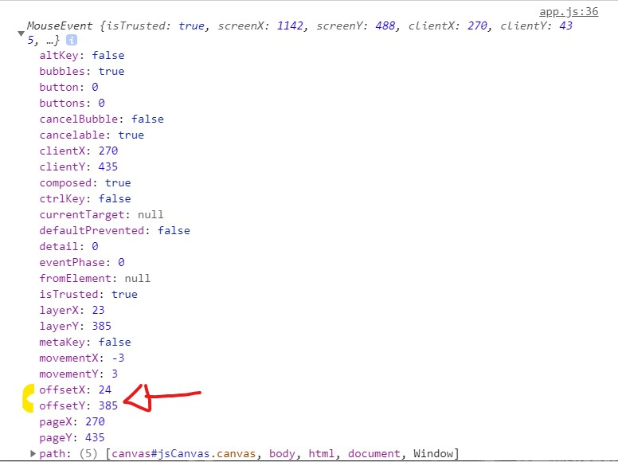

# Painting Board 2021🎨

## 🚩 Table of Contents

-   [🗼Screen](#screen)
-   [📦How to run](#how-to-run)
-   [🔧Main techniques used](#main-techniques-used)
-   [🔎Reference web link](#reference-web-link)
-   [🌏Web Support](#web-support)
-   [❗Realization](#realization)

### 🗼Screen

#### 📦How to run

Development Environment Version  
Visual Studio code -v 1.57  
git -v 2.32.0.window.1

-   [reset CSS](https://meyerweb.com/eric/tools/css/reset)
-   Code copy
-   Create reset.css
-   import "reset.css";
-   option > [Live Server](https://marketplace.visualstudio.com/items?itemName=ritwickdey.LiveServer) install

### 🔧Main techniques used

| Name                                                                           | Description              |
| ------------------------------------------------------------------------------ | ------------------------ |
| [`range`](https://github.com/dongmin7208/paintjs/blob/main/index.html)         | controlled by range.     |
| [`fillRect()`](https://github.com/dongmin7208/paintjs/blob/main/app.js)        | Draws a filled rectangle |
| [`preventDefault()`](https://github.com/dongmin7208/paintjs/blob/main/app.js)  | Prevent right-click      |
| [`.addEventListener`](https://github.com/dongmin7208/paintjs/blob/main/app.js) | Used to register events  |
| [`.getElementById`](https://github.com/dongmin7208/paintjs/blob/main/app.js)   | Find id properties.      |

## 🔎Reference web link

:school: [`nomadcoders`](https://nomadcoders.co/)

:book: [`Canvas-Docs`](https://developer.mozilla.org/en-US/docs/Web/API/CanvasRenderingContext2D)

:book: [`CSS:active`](https://www.w3schools.com/cssref/sel_active.asp)

## 🌏Web Support

|  Chrome |  Internet Explorer |  Edge |  Safari |  Firefox |
| :--------------------------------------------------------------------------------------------------------------------------------------------------------------: | :---------------------------------------------------------------------------------------------------------------------------------------------------------------------: | :----------------------------------------------------------------------------------------------------------------------------------------------------------: | :--------------------------------------------------------------------------------------------------------------------------------------------------------------: | :----------------------------------------------------------------------------------------------------------------------------------------------------------------: |
|                                                                               Yes                                                                                |                                                                                   11+                                                                                   |                                                                             Yes                                                                              |                                                                               Yes                                                                                |                                                                                Yes                                                                                 |

## ❗Realization

I found out that < input type="range"/>.  
The <'canvas'>element is essential for all tasks dealing with pixels.  
box-shadow: 0 4px 20px rgba(50, 50, 93, 0.5)  
(offset-x | offset-y | blur-radius | color)

Get the coordinates of the "cursor"  
We simply used offset here.

canvas.addEventListener("mousemove", onMouseMove);  
const x = event.offsetX;  
const y = event.offsetY;  

